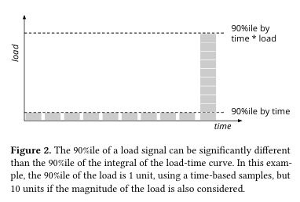

+++
title = "K8s Vertical Pod Autoscaler's Algorithm"
date = "2024-08-06"
description = "A look at the Vertical Pod Autoscaler's Algorithm. Documentation of the VPA algorithm"

tags = ["algorithms","kubernetes","vertical-pod-autoscaler"]
+++
I tried to understand how the Vertical Pod Autoscaler(VPA) works and found a comment[[1]](https://github.com/kubernetes/autoscaler/issues/2747#issuecomment-616037197) by this gentleman([@yashbutwala](https://github.com/yashbhutwala)) explaining in brief how it works:
> recommendations are calculated using decaying histogram of weighted samples from the metrics server, where the newer samples are assigned higher weights; older samples are decaying and hence affect less and less w.r.t. to the recommendations. CPU is calculated using the 90th percentile of all cpu samples, and memory is calculated using the 90th percentile peak over the 8 day window

I wanted to dig deeper to get at the essence of the recommender's algorithm. 
This is my attempt to document my digging. 

**Note:** This post is latest as on [`402ea4176`](https://github.com/kubernetes/autoscaler/tree/402ea4176fea622ebb2279ada1f94232705de400/vertical-pod-autoscaler). 

- [Background](#background)
- [The algorithm](#the-algorithm)
	- [Raw Signal](#raw-signal)
	- [The Histogram](#the-histogram)
		- [Exponential bucketing scheme](#exponential-bucketing-scheme)
		- [Percentiles](#percentiles)
	- [The weight of a sample](#the-weight-of-a-sample)
		- [Exponential Decay Multiplier](#exponential-decay-multiplier)
		- [Load-adjusted CPU usage multiplier](#load-adjusted-cpu-usage-multiplier)
	- [Safety margin](#safety-margin)
	- [Confidence Multiplier](#confidence-multiplier)
	- [Upper bound and Lower bound](#upper-bound-and-lower-bound)
	- [Minimum Resources](#minimum-resources)
- [Conclusion](#conclusion)
- [References](#references)


## Background
The VPA solves the problem of optimal resource allocation for CPU and Memory. 
The solution space for this problem takes a few different approaches[[2]](https://pdfs.semanticscholar.org/74d8/8b2c2bbba11c42439ca9184c8f90f53c43fe.pdf):
1. Threshold-based rules
2. Re-inforcement Learning
3. Queueing Theory 
4. Time-series analysis
5. Control Theory

The VPA takes the Time-series analysis approach to solving the problem. 

I don't go into more high-level detail about the VPA in this post.  
**TL;DR**: It reads metrics from Kubernetes' metrics server and analyzes samples from time-series for recommending resources.   
This talk is a really good introduction to the VPA:   

<iframe width="560" height="315" src="https://www.youtube.com/embed/Y4vnYaqhS74?si=CYzCB_99weeHtJia" title="YouTube video player" frameborder="0" allow="accelerometer; autoplay; clipboard-write; encrypted-media; gyroscope; picture-in-picture; web-share" referrerpolicy="strict-origin-when-cross-origin" allowfullscreen></iframe>


I highly recommend reading Google's paper on autoscalers for their clusters[[3]](https://research.google/pubs/autopilot-workload-autoscaling-at-google-scale/) as it seems to form the basis for the VPA's design.
I refer to it as the "reference paper" in this post.

## The algorithm 
In essence, the vertical pod autoscaler's algorithm aggregates the sample data collected to compute a recommendation. 
This section is structured to present the individual abstractions that the algorithm can be thought of as composed of in order of application.

### Raw Signal
The raw signal is composed of samples of the resource usage captured at given intervals.   
For CPU, simply a CPU usage sample is considered. It corresponds to the metric `container_cpu_usage_seconds_total`. 
For Memory, the maximum sample value is considered for a given aggregation interval(default=24h). It corresponds to the metric `container_memory_working_set_bytes`.  

<!--See [reference location](https://github.com/kubernetes/autoscaler/blob/402ea4176fea622ebb2279ada1f94232705de400/vertical-pod-autoscaler/pkg/recommender/input/history/history_provider.go#L286-L322).-->

<iframe frameborder="0" scrolling="no" style="width:100%; height:352px;" allow="clipboard-write" src="https://emgithub.com/iframe.html?target=https%3A%2F%2Fgithub.com%2Fkubernetes%2Fautoscaler%2Fblob%2F402ea4176fea622ebb2279ada1f94232705de400%2Fvertical-pod-autoscaler%2Fpkg%2Frecommender%2Finput%2Fhistory%2Fhistory_provider.go%23L298-L310&style=atom-one-dark-reasonable&type=code&showBorder=on&showLineNumbers=on&showFileMeta=on&showFullPath=on&showCopy=on"></iframe>


### The Histogram 
The raw resource usage signal is then aggregated into a histogram to save space. 
The Histogram partitions the input metric(resource usage) into buckets. 
The bucket's value is the associated weight of the sample. (We get into this in detail in the next section). 
To keep things simple, we consider the weight of the sample to be the number of ocurrences of a sample for now. 

<!--See [reference location](https://github.com/kubernetes/autoscaler/blob/402ea4176fea622ebb2279ada1f94232705de400/vertical-pod-autoscaler/pkg/recommender/util/histogram.go#L85-L104)-->


<iframe frameborder="0" scrolling="no" style="width:100%; height:499px;" allow="clipboard-write" src="https://emgithub.com/iframe.html?target=https%3A%2F%2Fgithub.com%2Fkubernetes%2Fautoscaler%2Fblob%2F402ea4176fea622ebb2279ada1f94232705de400%2Fvertical-pod-autoscaler%2Fpkg%2Frecommender%2Futil%2Fhistogram.go%23L85-L104&style=atom-one-dark-reasonable&type=code&showBorder=on&showLineNumbers=on&showFileMeta=on&showFullPath=on&showCopy=on"></iframe>



#### Exponential bucketing scheme 
Generally, the buckets of a histogram are partitioned equally. 
Eg: For a range \\([1, 10]\\) with \\(5\\) buckets, each bucket would contain \\(2\\) values. 
However, for a large range of values, a large number of buckets may be sparsely populated.
To avoid that, the VPA uses a histogram with an exponential bucketing scheme where the bucket sizes grow exponentially. 
This allows for having a lower granularity for extremely large values while having a high granularity for smaller and more likely values.

[This comment](https://github.com/kubernetes/autoscaler/blob/402ea4176fea622ebb2279ada1f94232705de400/vertical-pod-autoscaler/pkg/recommender/util/histogram_options.go#L53-L62) captures it well:

<iframe frameborder="0" scrolling="no" style="width:100%; height:289px;" allow="clipboard-write" src="https://emgithub.com/iframe.html?target=https%3A%2F%2Fgithub.com%2Fkubernetes%2Fautoscaler%2Fblob%2F402ea4176fea622ebb2279ada1f94232705de400%2Fvertical-pod-autoscaler%2Fpkg%2Frecommender%2Futil%2Fhistogram_options.go%23L53-L62&style=atom-one-dark-reasonable&type=code&showBorder=on&showLineNumbers=on&showFileMeta=on&showFullPath=on&showCopy=on"></iframe>


It also uses a config option named `espilon` but we don't need to know about it for the purpose of this post. 

Default ratio: [1.05 i.e. 5% larger](https://github.com/kubernetes/autoscaler/blob/402ea4176fea622ebb2279ada1f94232705de400/vertical-pod-autoscaler/pkg/recommender/model/aggregations_config.go#L71-L72)

#### Percentiles
The percentile of a histogram is defined as the weight of the bucket that contains the \\(p\\)-th percentile value.
This gives us a way to approximately compute a percentile.

It is [computed](https://github.com/kubernetes/autoscaler/blob/402ea4176fea622ebb2279ada1f94232705de400/vertical-pod-autoscaler/pkg/recommender/util/histogram.go#L159-L179) as:


<iframe frameborder="0" scrolling="no" style="width:100%; height:520px;" allow="clipboard-write" src="https://emgithub.com/iframe.html?target=https%3A%2F%2Fgithub.com%2Fkubernetes%2Fautoscaler%2Fblob%2F402ea4176fea622ebb2279ada1f94232705de400%2Fvertical-pod-autoscaler%2Fpkg%2Frecommender%2Futil%2Fhistogram.go%23L159-L179&style=atom-one-dark-reasonable&type=code&showBorder=on&showLineNumbers=on&showFileMeta=on&showFullPath=on&showCopy=on"></iframe>


Default percentile: [90% for target](https://github.com/kubernetes/autoscaler/blob/402ea4176fea622ebb2279ada1f94232705de400/vertical-pod-autoscaler/pkg/recommender/logic/recommender.go#L31-L36).

### The weight of a sample
In a bare histogram, the weight of a bucket is it's ocurrence.
For more sophisticated use-cases, the weight assigned can be tweaked to introduce a "bias". 
The recommender algorithm introduces the following biases:
1. Exponential Decay multiplier 
2. Load-Adjusted CPU usage multiplier

#### Exponential Decay Multiplier
The Google Autopilot paper mentions the following rationale behind introducing an exponential decay multiplier: 
> We want the limits to increase swiftly in response to rising
> usage, but reduce slowly after the load decreases to avoid a
> too-rapid response to temporary downward workload fluc-
> tuations. 

To "bias" the weight of the histogram's samples towards more recent samples, the weight of a sample is multiplied by an [exponentially decaying](https://en.wikipedia.org/wiki/Exponential_decay) multiplier:
$$2^{\Large {\frac{t - t_0}{\lambda}}}$$

where \\(t - t_0\\) is the relative age of given sample with respect to a reference timestamp,
and \\(\lambda\\) is the [half-life](https://en.wikipedia.org/wiki/Half-life)(24 hours by default). 
<!--
See [reference location](https://github.com/kubernetes/autoscaler/blob/402ea4176fea622ebb2279ada1f94232705de400/vertical-pod-autoscaler/pkg/recommender/util/decaying_histogram.go#L108-L118)-->

<iframe frameborder="0" scrolling="no" style="width:100%; height:310px;" allow="clipboard-write" src="https://emgithub.com/iframe.html?target=https%3A%2F%2Fgithub.com%2Fkubernetes%2Fautoscaler%2Fblob%2F402ea4176fea622ebb2279ada1f94232705de400%2Fvertical-pod-autoscaler%2Fpkg%2Frecommender%2Futil%2Fdecaying_histogram.go%23L108-L118&style=atom-one-dark-reasonable&type=code&showBorder=on&showLineNumbers=on&showFileMeta=on&showFullPath=on&showCopy=on"></iframe>


#### Load-adjusted CPU usage multiplier
The reference paper(define properly) mentions the following rationale for using load-adjusted weights for CPU:
> In many cases, we want to ensure that a given
> percentile of the offered load can be served when the limit
> is set to accommodate the offered load, rather than simply
> a count of times that instantaneous observed load can be
> handled – i.e, we want to weight the calculation by the load,
> not the sample count. 

A [comment in code](https://github.com/kubernetes/autoscaler/blob/402ea4176fea622ebb2279ada1f94232705de400/vertical-pod-autoscaler/pkg/recommender/model/aggregate_container_state.go#L207-L222) explains it the best: 

<iframe frameborder="0" scrolling="no" style="width:100%; height:184px;" allow="clipboard-write" src="https://emgithub.com/iframe.html?target=https%3A%2F%2Fgithub.com%2Fkubernetes%2Fautoscaler%2Fblob%2F402ea4176fea622ebb2279ada1f94232705de400%2Fvertical-pod-autoscaler%2Fpkg%2Frecommender%2Fmodel%2Faggregate_container_state.go%23L210-L214&style=atom-one-dark-reasonable&type=code&showBorder=on&showLineNumbers=on&showFileMeta=on&showFullPath=on&showCopy=on"></iframe>

This figure in the reference paper highlights this point visually: 

<!--The problem is that the usage needs to be considered in the context of the resources available. 
If a process was consuming 2 vCPUs when 2 vCPUs were requested, but, later consumes 2 vCPUs with 8 vCPUs requested, 
a simple percentile won't capture this. 
To get closer to a "utilization"-like metric, the CPU requested is considered to be the weight of a sample.
<!--See [reference location](https://github.com/kubernetes/autoscaler/blob/402ea4176fea622ebb2279ada1f94232705de400/vertical-pod-autoscaler/pkg/recommender/model/aggregate_container_state.go#L207-L222)-->

### Safety margin
This is simply a %age margin that the recommended request is scaled by for safety. 
$$recommendation = (1 + safetyMargin) \times recommendation$$
<!--See [reference location](https://github.com/kubernetes/autoscaler/blob/402ea4176fea622ebb2279ada1f94232705de400/vertical-pod-autoscaler/pkg/recommender/logic/estimator.go#L140-L148)-->

<iframe frameborder="0" scrolling="no" style="width:100%; height:100px;" allow="clipboard-write" src="https://emgithub.com/iframe.html?target=https%3A%2F%2Fgithub.com%2Fkubernetes%2Fautoscaler%2Fblob%2F402ea4176fea622ebb2279ada1f94232705de400%2Fvertical-pod-autoscaler%2Fpkg%2Frecommender%2Flogic%2Festimator.go%23L144&style=atom-one-dark-reasonable&type=code&showBorder=on&showLineNumbers=on&showFileMeta=on&showFullPath=on&showCopy=on"></iframe>


Default value: [15%](https://github.com/kubernetes/autoscaler/blob/402ea4176fea622ebb2279ada1f94232705de400/vertical-pod-autoscaler/pkg/recommender/logic/recommender.go#L28)

### Confidence Multiplier
As the VPA recommends resources based on historical resource usage, 
if the available data is negligible, the recommendation isn't likely to be correct. 
Therefore, the confidence multiplier was introduced. 
From a [comment in code](https://github.com/kubernetes/autoscaler/blob/402ea4176fea622ebb2279ada1f94232705de400/vertical-pod-autoscaler/pkg/recommender/logic/recommender.go#L118-L128): 
```go
// ...  This means
// that the updater will be less eager to evict pods with short history
// in order to reclaim unused resources.
```
The confidence multiplier is a heuristic defined as:
$$\Biggl[{1 + {\frac{multiplier}{confidence}}} \Biggr] ^ {exponent}$$
\\(multiplier\\) and \\(exponent\\) are heuristic values specified statically in code. 

\\(confidence\\) is a measure of the available historical data. It is defined as: 
$$confidence = min(lifespan, samplesAmount)$$
where  \\(lifespan =  t_n - t_0\\) measured in days,
and \\(samplesAmount = {\large \frac{numSamples}{60 \times 24} }\\) such that it represents the number of days for which samples are available assuming a rate of 1 sample/minute.       

<iframe frameborder="0" scrolling="no" style="width:100%; height:331px;" allow="clipboard-write" src="https://emgithub.com/iframe.html?target=https%3A%2F%2Fgithub.com%2Fkubernetes%2Fautoscaler%2Fblob%2F402ea4176fea622ebb2279ada1f94232705de400%2Fvertical-pod-autoscaler%2Fpkg%2Frecommender%2Flogic%2Frecommender.go%23L118-L129&style=atom-one-dark-reasonable&type=code&showBorder=on&showLineNumbers=on&showFileMeta=on&showFullPath=on&showCopy=on"></iframe>

<!--See [reference location](https://github.com/kubernetes/autoscaler/blob/402ea4176fea622ebb2279ada1f94232705de400/vertical-pod-autoscaler/pkg/recommender/logic/estimator.go#L106-L119)-->

### Upper bound and Lower bound 
The VPA recommender computes three recommendations with different settings - Lower bound, Target, and Upper bound.
The updater component of the VPA uses this update a pod if the resource request is outside the range \\((lowerBound, upperBound)\\).

<!--See [reference location](https://github.com/kubernetes/autoscaler/blob/402ea4176fea622ebb2279ada1f94232705de400/vertical-pod-autoscaler/pkg/updater/priority/update_priority_calculator.go#L121-L124)-->

<iframe frameborder="0" scrolling="no" style="width:100%; height:163px;" allow="clipboard-write" src="https://emgithub.com/iframe.html?target=https%3A%2F%2Fgithub.com%2Fkubernetes%2Fautoscaler%2Fblob%2F402ea4176fea622ebb2279ada1f94232705de400%2Fvertical-pod-autoscaler%2Fpkg%2Fupdater%2Fpriority%2Fupdate_priority_calculator.go%23L121-L124&style=atom-one-dark-reasonable&type=code&showBorder=on&showLineNumbers=on&showFileMeta=on&showFullPath=on&showCopy=on"></iframe>


### Minimum Resources 
The recommender imposes a minimum value for both resources - CPU and Memory. 

<iframe frameborder="0" scrolling="no" style="width:100%; height:184px;" allow="clipboard-write" src="https://emgithub.com/iframe.html?target=https%3A%2F%2Fgithub.com%2Fkubernetes%2Fautoscaler%2Fblob%2F402ea4176fea622ebb2279ada1f94232705de400%2Fvertical-pod-autoscaler%2Fpkg%2Frecommender%2Flogic%2Frecommender.go%23L76-L80&style=atom-one-dark-reasonable&type=code&showBorder=on&showLineNumbers=on&showFileMeta=on&showFullPath=on&showCopy=on"></iframe>

<!--See [reference location](https://github.com/kubernetes/autoscaler/blob/402ea4176fea622ebb2279ada1f94232705de400/vertical-pod-autoscaler/pkg/recommender/logic/recommender.go#L76-L80)-->

Default value: 
1. CPU - [0.025 vCPU](https://github.com/kubernetes/autoscaler/blob/402ea4176fea622ebb2279ada1f94232705de400/vertical-pod-autoscaler/pkg/recommender/logic/recommender.go#L29)
2. Memory - [250 MB](https://github.com/kubernetes/autoscaler/blob/402ea4176fea622ebb2279ada1f94232705de400/vertical-pod-autoscaler/pkg/recommender/logic/recommender.go#L30)

## Conclusion
To understand the algorithm, I think the final piece of the puzzle involves the considerations for choosing a suitable algorithm that the reference paper mentions. 
For memory, the risk of using an incorrect recommendation can lead to OOM errors. For critical workloads, the maximum peak memory usage is considered to avoid any disruption due to an OOM. For less critical ones, percentiles from \\(P_{98}\\) to even lower percentiles can be used. 
For CPU, the risk is much less grave as an incorrect recommendation can result in CPU throttling in the worst case. Thus, we can use a percentile(eg: \\(P_{95}\\)) or even average if the workload is not CPU-bound. 

## References 
1. https://github.com/kubernetes/autoscaler/issues/2747#issuecomment-616037197
2. https://pdfs.semanticscholar.org/74d8/8b2c2bbba11c42439ca9184c8f90f53c43fe.pdf
3. https://research.google/pubs/autopilot-workload-autoscaling-at-google-scale/


---
Thanks to Shlok for the initial discussion that sparked my interest in the VPA.  
Thanks to Ashu for encouraging me to explore the VPA.    
Thanks to Suraj and Gaurav for reviewing this post.     
